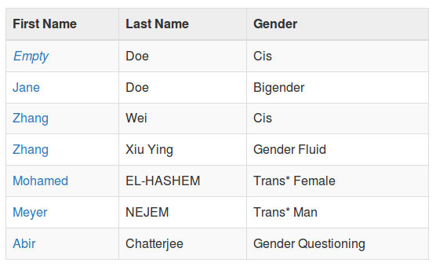
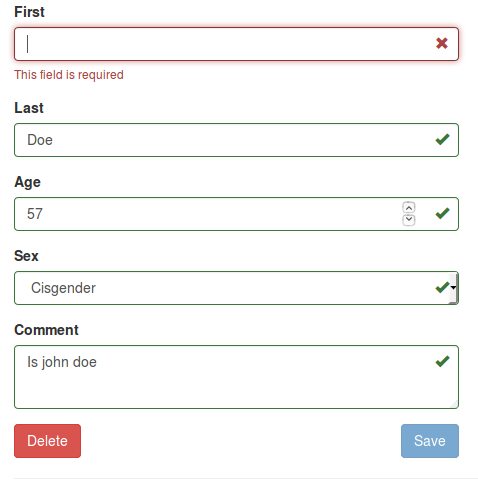

# tableManager

tableManager is an easy to use PHP library that provides a web GUI for handling database CRUD for MySQL. 
While the canonical MySQL web GUI is [phpMyAdmin](https://www.phpmyadmin.net/), it is substantially 
more complicated than tableManager. If you're looking for a simple framework that allows you to Create, 
Read, Update and Delete (C.R.U.D.) rows in a MySQL database using a PHP server and a web front end, this 
tool is what you've always been looking for.

For version 1.3, tableManager naively assumes that each table has a single column primary key. Also, 
while it uses [PDO](http://php.net/manual/en/pdo.installation.php), it is not tested against anything but MySQL. 

tableManager has built-in support for the libraries listed in the optional section below (stupidtable, formvalidation.io and bootstrap) but it should be easy to use it with other tools and frameworks.

### Security

tableManager uses extensive protection to ensure there are no MySQL injection vectors in the library. It protects against cross site request forgery. All cookies are written to be SSL-only and http-only. Finally, all output is cleansed to ensure there are no cross site scripting vectors.

Following OWASP best practices, tableManager does the following:

* [Sanitize database output](https://www.owasp.org/index.php/XSS_(Cross_Site_Scripting)_Prevention_Cheat_Sheet#RULE_.236_-_Sanitize_HTML_Markup_with_a_Library_Designed_for_the_Job)
* [Query Parameterization](https://www.owasp.org/index.php/Query_Parameterization_Cheat_Sheet)
* [Secure Cookies](https://www.owasp.org/index.php/SecureFlag)
* [HTTP Only Cookies](https://www.owasp.org/index.php/HttpOnly)
* [Anti-CSRF Nonces](https://www.owasp.org/index.php/Cross-Site_Request_Forgery_(CSRF)_Prevention_Cheat_Sheet)

## Requirements

*  MySQL 5.02 or greater for [INFORMATION_SCHEMA](https://dev.mysql.com/doc/refman/5.7/en/information-schema.html) support
*  PHP 5.1 or greater for [PDO](http://php.net/manual/en/pdo.installation.php) support
*  PHP mysql extension (``php-mysql``)

Optional:
* [stupidtable.js](https://joequery.github.io/Stupid-Table-Plugin/) 
* [formvalidation.io](http://formvalidation.io)
* [bootsrap](http://getbootstrap.com/)

## Examples

The example images shown here are taken from the ``examples`` directory which has a working PHP app using the ``tableManager`` class:

### List Rows

Customizable, sortable table with click to edit links for each row:



### Edit Form

Dynamic edit form based on table schema including error handling:



## Installation 

While you're welcome to use code from the examples area, the tl;dr 
is to [download the latest release](https://github.com/Packet-Clearing-House/tableManager/releases/latest) and 
extract the ``tableManager.php`` file. See "Methods" below for how to use.

Please note that all ``tableManager`` calls may throw an exception, including the constructor. Be sure to 
wrap all your calls in a ``try{}catch(Exception $e){}``

## Methods

These are the most simple calls to the methods. See the [examples](https://github.com/Packet-Clearing-House/tableManager/tree/add-examples/examples) section and [phpdocs](https://github.com/Packet-Clearing-House/tableManager/tree/add-examples/phpdoc) for details on all calls.

Instantiate the class with valid parameters to set up a database handle. TYPE and PORT default 
to 'mysql' and 3306 respectively: 

```php
$tm = new tableManager(DB_SERVER, DB_USER, DB_PASS, DATABASE, TABLE);
```

To get all the rows from a table use ``getRowsFromTable()``. This defaults to the table 
passed into the constructor

```php
$rowsArray = $tm->getRowsFromTable();
```
To show the rows you just retrieved use ``getHtmlFromRows()`` and pass in the rows 
from ``getRowsFromTable()`` as well as the URI for editing a row. The second parameter will 
depend on your implementation, but the ID of the row will be appended to a query string. 
It's handy to use the ``$tm->table`` member variable here:

```php
print $tm->getHtmlFromRows($rowsArray, "/edit?table={$tm->table}&id=");
```

If have an column that you want show as a link, you can use the ``$tm->setFieldLink`` method to specify the URL and filed you want to link:

```php
$tm->setFieldLink('https://sample.com/id/', 'field_name');
```

To show the create form  (also the edit form) for a table use ``getAddEditHtml()``. Pass 
in ``null``, ``add`` and the action for adding a row:

```php
print $tm->getAddEditHtml(null, 'add', "/save?table={$this->table}");
```

Note - ``getAddEditHtml()`` sets a cookie.

Or, use ``getRowFromTable()`` to prefetch a row when you're editing a row. This will pre-
populate the form with the data from ``$row``:

```php
$row = $tm->getRowFromTable($_GET['id']);
print $tm->getAddEditHtml($row, 'edit', "/save?table={$this->table}");
```

To delete, update or add a row, use the following methods which assume you're posting using 
the form from ``getAddEditHtml()`` which passes the ``tm_key_action`` member variable value on submit:

```php
$action = $tm->tm_key . '_action';
if ($_POST[$action] == 'delete') {
    $tm->delete($_POST);
} elseif ($_POST[$action] == 'edit') {
    $tm->update($_POST);
} elseif ($_POST[$action] == 'add') {
    $tm->create($_POST);
}
```

## Development

Pull requests are always welcome!  

Please ensure your code has no warnings in the error log. Also, do as I do: 

1. Make sure the ``sample.sql`` is loaded and configed per below 
1. ``cd`` into the ``examples`` directory
1. run a web server via ``php -S  localhost:8000``
1. cut a new branch for your changes
1. edit ``tableManager.php`` and ensure there's a working example which tests my change
1. update README.md if needed
1. open a pull request (PR) for your change
1. code review/QA the PR
1. request PR be merged upstream

If you need to install the ``sample.sql`` file so the examples work, ``cd`` into the examples directory:

1. It's assumed you're using a localhost instance of mysql that uses passwordless root access.  If so, run this:  ``mysql -u root < sample.sql``. If you need to specify a server or a password, do so accordingly with ``-h SERVER`` and ``-p`` respectively.
1. Copy the ``config.dist.php`` to ``config.php``. If you used different credentials than the default, update this file to have the correct entries.

If you've added a new method or changed the PhpDoc for an existing method, update the ``phpdoc`` folder by:

1. Installing [phpDocumentor](https://www.phpdoc.org/) (Note that ``pear install phpdoc/phpDocumentor`` install failed to work and I had to use the .phar biniary)
1. In the ``tableManager`` directory run phpdoc like this: ``PATH_TO_PHAR~/phpDocumentor.phar run -f tableManager.php -t phpdoc``
1. Ensure the resulting changes in the ``phpdoc`` folder make sense (IE we only expect one or two files to change, not everything ;). Ensure that there's no errors on the ``reports/errors.html`` page.

If you're adding a new file to the ``examples`` pages and need to generate syntax highlighted HTML from your php, use [hilite.me](http://hilite.me/).

## Release history

* 1.5 - Mar 27, 2019 - Add developer docs per [#17](https://github.com/Packet-Clearing-House/tableManager/issues/17), allow field hyperlinks via ``setFieldLink()`` per [#16](https://github.com/Packet-Clearing-House/tableManager/issues/16), preventitively file and close [#18](https://github.com/Packet-Clearing-House/tableManager/issues/18) (Error: Undefined class constant 'MYSQL_ATTR_INIT_COMMAND')
* 1.4 - Mar 29th, 2018 - Add filter on ``getRowsFromTable()`` [#14](https://github.com/Packet-Clearing-House/tableManager/issues/14)
* 1.3.1 - June 6th, 2017 - Fix empty check per [#11](https://github.com/Packet-Clearing-House/tableManager/issues/11)
* 1.3 - Apr 11th, 2017 - Update security docs per [#5](https://github.com/Packet-Clearing-House/tableManager/issues/5), add way to do development with non-ssl per [#6](https://github.com/Packet-Clearing-House/tableManager/issues/6), add sort to enum/drop downs per [#7](https://github.com/Packet-Clearing-House/tableManager/issues/7)
* 1.2 - Mar 18th, 2017 - Add protection against [CSRF](https://www.owasp.org/index.php/Cross-Site_Request_Forgery_(CSRF))
* 1.1 - Mar 16th, 2017 - Add Examples & phpDocs, fixed minor bug in edit form CSS
* 1.0 - Mar 15th, 2017 - First post

## License 

MIT
